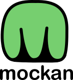

    

Mock an API server
---

> [!CAUTION]
> There is no current release, I am still building the MVP.

mockan is a mock API server that helps teams work with Machine Learning/AI workflows. Teams can do experimentation without incurring into high costs and without waiting for the models to be ready, or simulate incidents.

It simulates a working API (input, ouput, queues, delay and saturation/errors) of multiple cloud AI services ([OpenAI](https://platform.openai.com/docs/overview), [Anthropic](https://docs.anthropic.com/en/api/getting-started), [AWS Bedrock](https://docs.aws.amazon.com/bedrock/latest/APIReference/welcome.html)) and self-served ([NVIDIA Triton Inference Server](https://developer.nvidia.com/triton-inference-server), [Torchserve](https://github.com/pytorch/serve), [TensorFlow Serving](https://github.com/tensorflow/serving)). There are many included mock models and you can create new ones easily.

# Why should I use this?

## Test the rest of the system

- Any team can create multiple scenarios and learn how each sub-system will react to outages, saturation or broken deployments without bugging the ML team and without asking for resources.
- Future-proof your system. Check how eventual success will impact your job activities.

## Decouple development

- You don't have to wait for an API key or an ML engineer to create the service.
- Prepare for the integration tests

# Documentation

Following the [Diátaxis](https://diataxis.fr/) framework developed by Daniele Procida, the documentation is split into 4 categories:

## How to use

You can't (yet).

## Tutorials

## Explanation

## Reference

